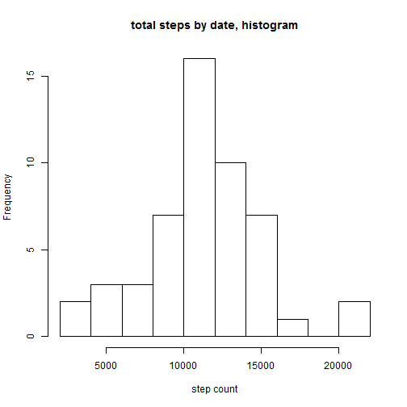
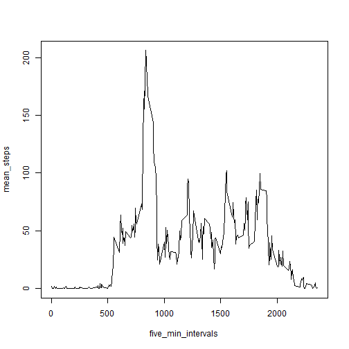
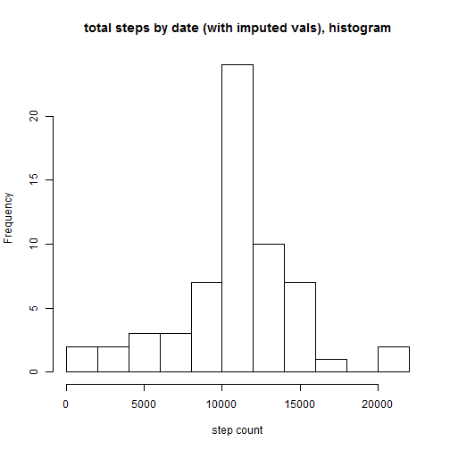
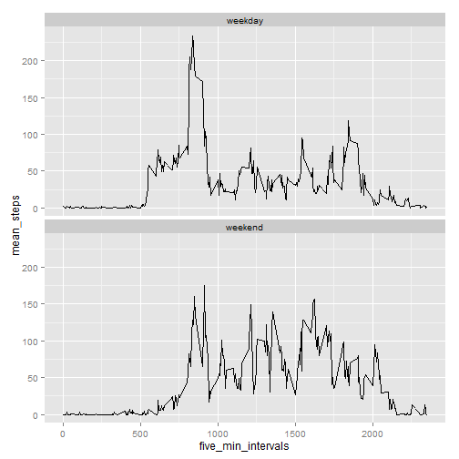

#Step 1: we can have lots of fun

Load the data from the .zip file on cloudfront


```r
temp <- tempfile()
download.file("https://d396qusza40orc.cloudfront.net/repdata%2Fdata%2Factivity.zip",temp)
raw_activity_data <- read.csv(unz(temp, "activity.csv"))
unlink(temp)
```
Ignoring the null values


```r
activity_data <- subset(raw_activity_data,steps!="NA")
```

#Part the 2nd: total steps per date

Load the dplyr package and summarise average number of steps by date. I am also excluding outliers, which I have defined as anything where the absolute value of the difference between the log of the actual measurement and the mean log measurement is greater than 2.5 standard deviations (in practice, there are no values between approx. 1.2 standard devs and 4 standard devs, so 2.5 is an arbitrary midpoint). This results in two dates being excluded, including the first day, where we might surmise that the device was not switched on for the first time until later that day.


```r
library(dplyr)
```

```
## 
## Attaching package: 'dplyr'
## 
## The following objects are masked from 'package:stats':
## 
##     filter, lag
## 
## The following objects are masked from 'package:base':
## 
##     intersect, setdiff, setequal, union
```

```r
total_steps_by_date <- activity_data %>% group_by(date) %>% summarise(sum(steps))
colnames(total_steps_by_date) <- c("date","total_steps")
ts <- total_steps_by_date$total_steps
total_steps_by_date$abs_log_var_in_sigma <- abs((log(ts)-mean(log(ts)))/sd(log(ts)))
dim(subset(total_steps_by_date,abs_log_var_in_sigma>2.5))
```

```
## [1] 2 3
```

```r
total_steps_by_date <- subset(total_steps_by_date,abs_log_var_in_sigma<=2.5)
```
Histogram? You betcha!


```r
hist(total_steps_by_date$total_steps,breaks=8,main="total steps by date, histogram",xlab="step count")
```

 

Mean and median step calcs per day


```r
mean_by_day <- mean(total_steps_by_date$total_steps)
median_by_day <- median(total_steps_by_date$total_steps)
mean_to_print <- prettyNum(mean_by_day,big.mark = ",",big.interval = 3)
median_to_print <- prettyNum(median_by_day,big.mark = ",",big.interval = 3)
```

Basically, the mean steps per day is 11,185.12 and the median steps per day is 11,015.

#Part the 3rd: mean steps per interval

The basic summary by interval + a time-series plot:


```r
mean_steps_by_interval <- activity_data %>% group_by(interval) %>% summarise(mean(steps))
colnames(mean_steps_by_interval) <- c("five_min_intervals","mean_steps")
plot(mean_steps_by_interval,type = "l")
```

 

Looking at the pattern over the course of the day:


```r
max_mean_steps <- max(mean_steps_by_interval$mean_steps)
relevant_interval <- subset(mean_steps_by_interval,mean_steps==max_mean_steps)
max_mean_steps_interval <- relevant_interval$five_min_intervals
max_mean_steps_to_print <- prettyNum(round(max_mean_steps,-1),big.mark = ",",big.interval = 3)
```

So, what have we here? Seems like this person's highest step level on average is interval 835 (I think that's roughly a time of day) with 210 steps on average.

#Part the 4th: but what about the missing data?

Okay, now let's look at any records that have NA listed for step count:


```r
total_records_count <- prettyNum(length(raw_activity_data$steps),big.mark = ",",big.interval = 3)
missing_activity_data <- subset(raw_activity_data,is.na(raw_activity_data$steps))
na_records_count <- prettyNum(length(missing_activity_data$steps),big.mark = ",",big.interval = 3)
```

There are 2,304 missing records out of 17,568 total.

#Part the 5th: let's try imputing values where they are missing

Okay, now let's try filling in the missing interval data with interval averages. Also, let's check to make sure the number of records is correct.


```r
missing_activity_data_with_imputed <- left_join(missing_activity_data,mean_steps_by_interval,by=c("interval"="five_min_intervals"))

missing_activity_data_with_imputed$steps <- missing_activity_data_with_imputed$mean_steps

missing_activity_data_with_imputed <- missing_activity_data_with_imputed[,1:3]

activity_data_with_imputed <- rbind(activity_data,missing_activity_data_with_imputed)

activity_data_with_imputed_record_count <- prettyNum(length(activity_data_with_imputed$steps),big.mark = ",",big.interval = 3)
activity_data_with_imputed_complete_cases_count <- prettyNum(sum(complete.cases(activity_data_with_imputed)),big.mark = ",",big.interval = 3)
```

So, the file with imputed figures has 17,568 total records and 17,568 of those are complete cases.

Let's review some of the by-day summary analyses for the data set with imputed values.


```r
total_steps_by_date_enhanced <- activity_data_with_imputed %>% group_by(date) %>% summarise(sum(steps))
colnames(total_steps_by_date_enhanced) <- c("date","total_steps")
mean_by_day_enhanced <- mean(total_steps_by_date_enhanced$total_steps)
median_by_day_enhanced <- median(total_steps_by_date_enhanced$total_steps)
mean_to_print_enhanced <- prettyNum(mean_by_day_enhanced,big.mark = ",",big.interval = 3)
median_to_print_enhanced <- prettyNum(median_by_day_enhanced,big.mark = ",",big.interval = 3)
mean_diff <- prettyNum(mean_by_day_enhanced-mean_by_day,big.mark = ",",big.interval = 3)
median_diff <- prettyNum(median_by_day_enhanced-median_by_day,big.mark = ",",big.interval = 3)
```

Basically, the mean steps per day is 10,766.19 and the median steps per day is 10,766.19. If the mean and the median are the same, it could be because there are several days that had all nulls to begin with, which are now each populating with the mean amount.

Mean steps per day with imputed values included less the mean steps simply ignoring missing values -418.929. The corresponding difference for medians is -248.8113.

Now, let's do another histogram:


```r
hist(total_steps_by_date_enhanced$total_steps,breaks=8,main="total steps by date (with imputed vals), histogram",xlab="step count")
```

 

#Part the 7th: working for the weekend

Let's look at the subject's step count on weekdays vs. weekend days. This is based on the earlier daily totals analysis:


```r
total_steps_by_date$day_type <- ifelse(weekdays(as.Date(total_steps_by_date$date))=="Saturday"|weekdays(as.Date(total_steps_by_date$date))=="Sunday","weekend","weekday")

mean_steps_by_day_type <- total_steps_by_date %>% group_by(day_type) %>% summarise(mean(total_steps))
colnames(mean_steps_by_day_type) <- c("date","mean_steps")
type_one <- mean_steps_by_day_type[1,1]
type_two <- mean_steps_by_day_type[2,1]
mean_type_one <- prettyNum(mean_steps_by_day_type[1,2],big.mark = ",",big.interval = 3)
mean_type_two <- prettyNum(mean_steps_by_day_type[2,2],big.mark = ",",big.interval = 3)
```

Looks like the subject averaged 10,722.95 steps per day on weekdays, but 12,406.57 steps per day on weekends.

Now, let's go back and do an analysis by weekday/weekend and interval.


```r
activity_data$day_type <- ifelse(weekdays(as.Date(activity_data$date))=="Saturday"|weekdays(as.Date(activity_data$date))=="Sunday","weekend","weekday")

mean_steps_by_interval_and_day_type <- activity_data %>% group_by(interval,day_type) %>% summarise(mean(steps))
colnames(mean_steps_by_interval_and_day_type) <- c("five_min_intervals","day_type","mean_steps")
mean_steps_by_interval_and_day_type$day_type_f <- as.factor(mean_steps_by_interval_and_day_type$day_type)
```

And then there's to be a split time-lapse graph showing averages by interval separately for weekdays and weekends:


```r
library(ggplot2)

ggplot(mean_steps_by_interval_and_day_type, aes(five_min_intervals, mean_steps)) + 
geom_line() + 
facet_wrap(~day_type,nrow=2)
```

 
